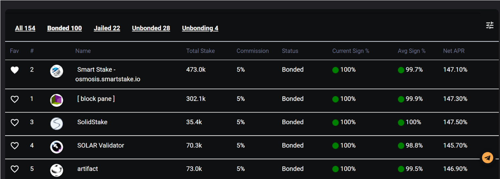
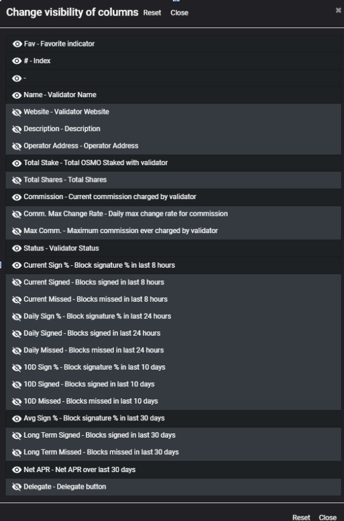
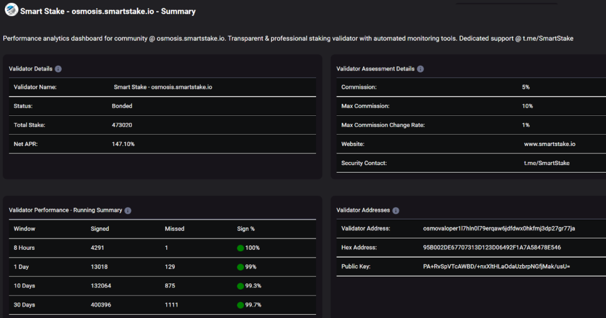
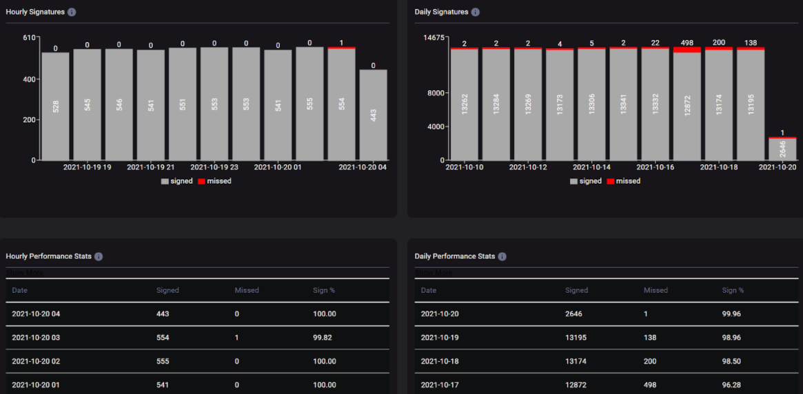
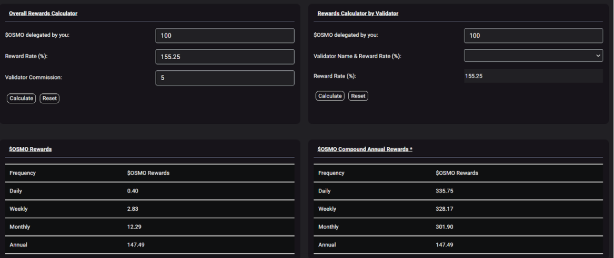

# Findora Analytics

**Proposer:** Smart Stake

# Project Description

Smart Stake, a staking validator, based on its experience, is looking to build tools to support the Findora ecosystem and provide user friendly features to assess validator performance.

Build a validator performance analytics dashboard providing detailed historical performance statistics and allowing delegates to assess validator performance in various ways. Build anticipated staking rewards calculator based on inflation (generic) and based on individual validator’s performance and commission.

## Deliverables
Analytics Dashboard - Analytics dashboard allows assessment of performance of each validator in current slashing window, short term (1 day, 10 days), long term (30 days) windows. The tooling will allow individual coin holders to assess the performance of the validator they stake with or want to stake with. These tools are also useful for monitoring of the validator health by validators, by IoTeX, and by community. 

Features included are:
  - Validator list
    -	Provide list of validators with filtering capability to allow listing of All, Bonded, Unbonded, Unbonding, & Jailed validators
    -	Allow marking validators as favorite/unfavorite. Favorite validators are shown on top of the list for easy access
    -	Support validator logos from tendermint validator identity attribute (if supported)
    -	Allow configurable view of data - show default set of data elements but provide users a way to change the view to include/exclude elements
    -	Support voting power percentage and cumulative voting power percentage (not shown in screenshot below) to allow assessing centralization of staking power

    
    -	Block signature percentage & APRs will be calculated over a short/current term (e.g. last 8 hour), 1 day, 10 days (medium term), and 30 days (average)
    -	All supported data elements are shown below (subject to applicability of data being available via RPC/REST interfaces)

    

  - Validator details screen - validator details screen will provide all the data available in above screenshot. It will also provide historical block signature data at hourly and daily intervals. By default, the block signature performance data will be available for the last 10 hours (hourly view) and last 10 days (daily view). Users will be able to change the time interval to an extended interval to see performance breakdown over last 30 days
    
    

  - Basic Stats (validator list screen) - Total Staked amount, Staking APR (based on staked amount and annual inflation)

  - Staking Rewards Calculator - anticipated staking rewards calculator allows users to see anticipated staking rewards based on network level APR as well as based on individual validators’s performance and commission. Below screenshot provides a sample view of the calculator
    

  - Notification Banner - dashboard/network level notification banner on the validator list screen and validator specific notifications on the validator home page. Notifications can be used to relay important messages about network aspects (e.g. urgent/planned upgrade messages or dashboard maintenance aspects or other announcements)
  - Backend data gathering scripts for validator profile details and performance details. Scripts for maintaining historical data of validator performance

## What’s in-scope/included
  - Development of the dashboard
  - Hosting of the dashboard
  - Maintenance & support cost for 1 year. Subsequent maintenance cost expected to be covered via validator revenue

## Dependency / Support Needed
  - Identification of relevant tendermint RPC/REST APIs (only in case some of the commonly supported tendermint APIs are not implemented/available in Findora)

## Previous Work Experience
Smart Stake has built advanced analytic dashboards & bots for multiple blockchains. Smart Stake builds custom analytics dashboard that meet the specific needs for each network and introduces new performance metrics to provide simpler ways to assess different aspects of the network. Some of the recently built dashboards by Smart Stake are 

  - https://secret.smartstake.io
  - https://osmosis.smartstake.io 
  - https://terra.smartstake.io 
  - https://tpa.smartstake.io (Terra performance Analytics)
  - https://mirror.smartstake.io 
  - https://xprt.smartstake.io (Persistence Analytics)  
  - https://harmony.smartstake.io 
  - https://cc.smartstake.io (Crypto.com analytics) 
  - https://iotex.smartstake.io 
  - https://oasis.smartstake.io 

## Delivery timeline
Building the dashboard involves significant development work for capturing the backend data and building the end-to-end functionality. This work generally takes about 4 weeks. All attempts will be made to deliver the dashboard within 2 weeks (or faster) from the start of grant work. The deliveries will be incremental to try and bring out the dashboard for use.

## Cost
USD $10,000 paid out in the form of Findora tokens.
